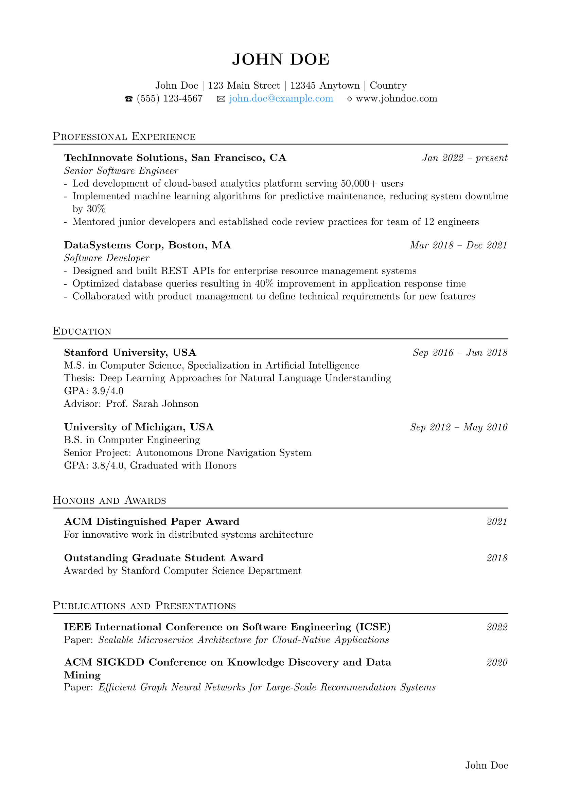

# Simple-CV

A minimalist LaTeX CV template built for clarity and readability. Single-file, black & white design intended primarily for academic and research positions.



## Philosophy

Simple-CV embraces three core principles:

- **Simplicity**: Single file implementation with no complex dependencies
- **Readability**: Clean typography and logical section organization
- **Academic Focus**: Designed with researchers and academics in mind

Inspired by the CVs of leading Machine Learning researchers, this template emphasizes content over decoration while maintaining professional polish.

## Usage

1. **Download**: Clone this repository or download `template.tex`
2. **Customize**: Edit the fields marked in the template with your information
3. **Compile**: Use any LaTeX compiler (pdfLaTeX recommended)

```bash
pdflatex template.tex
```

## Customization

The template is designed for easy modification:
- Change the color scheme by editing the color definitions
- Adjust spacing by modifying the geometry settings
- See [customization-guide.md](docs/customization-guide.md) for more options